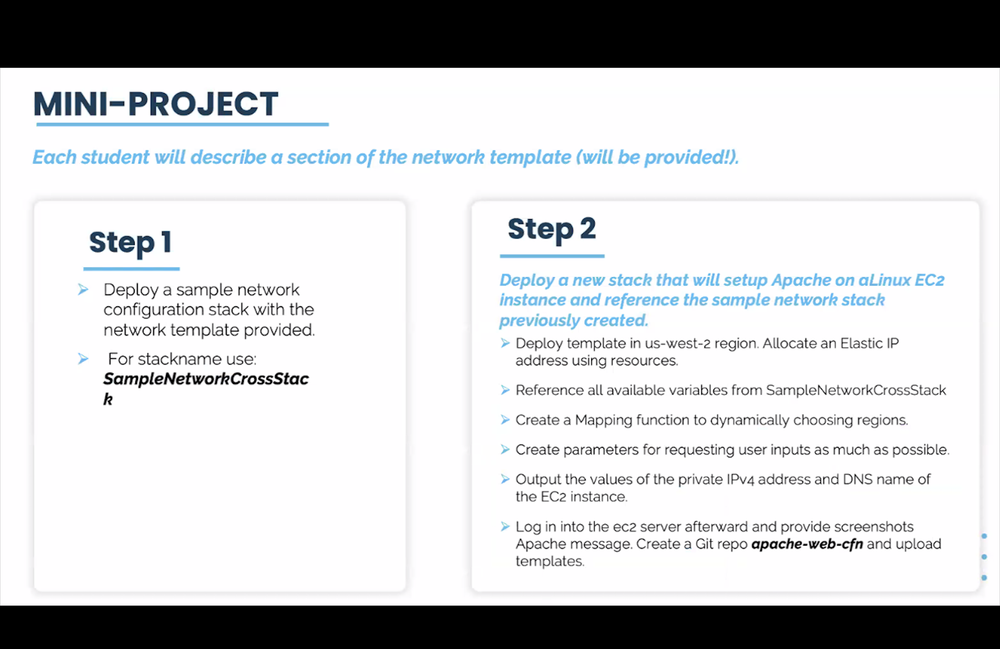
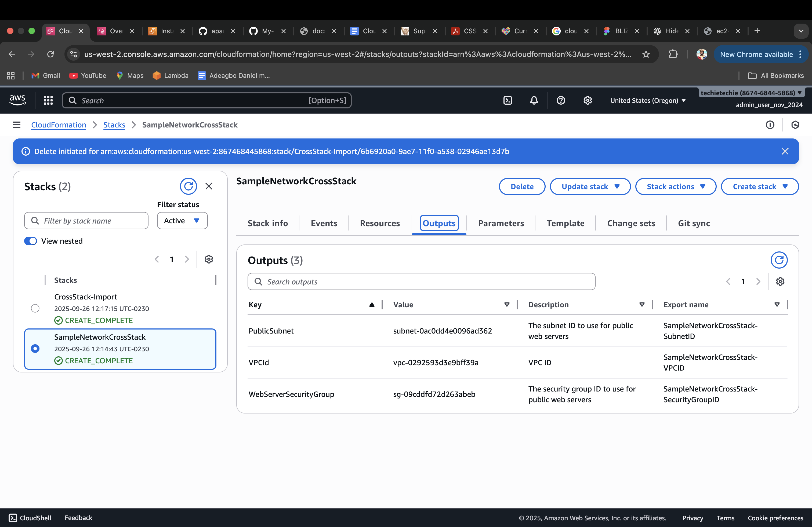
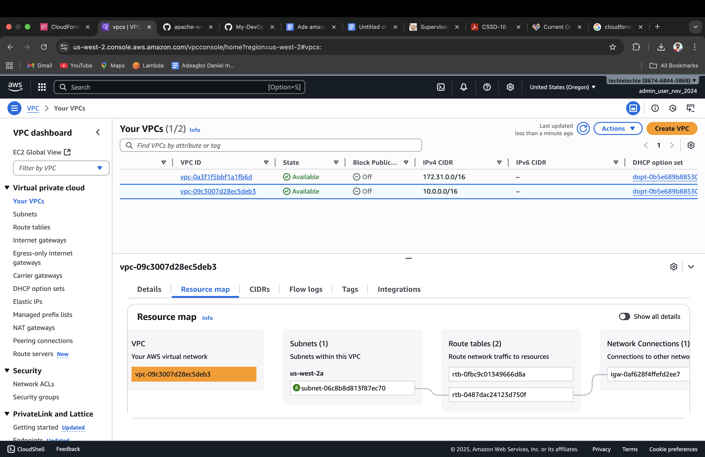
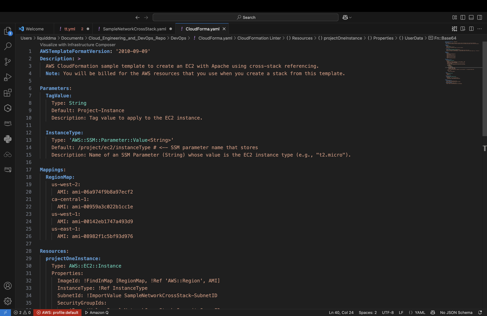
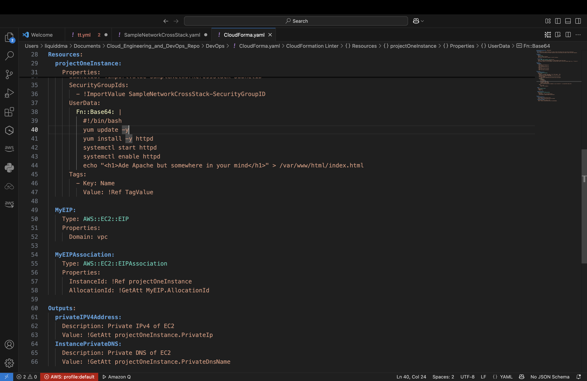
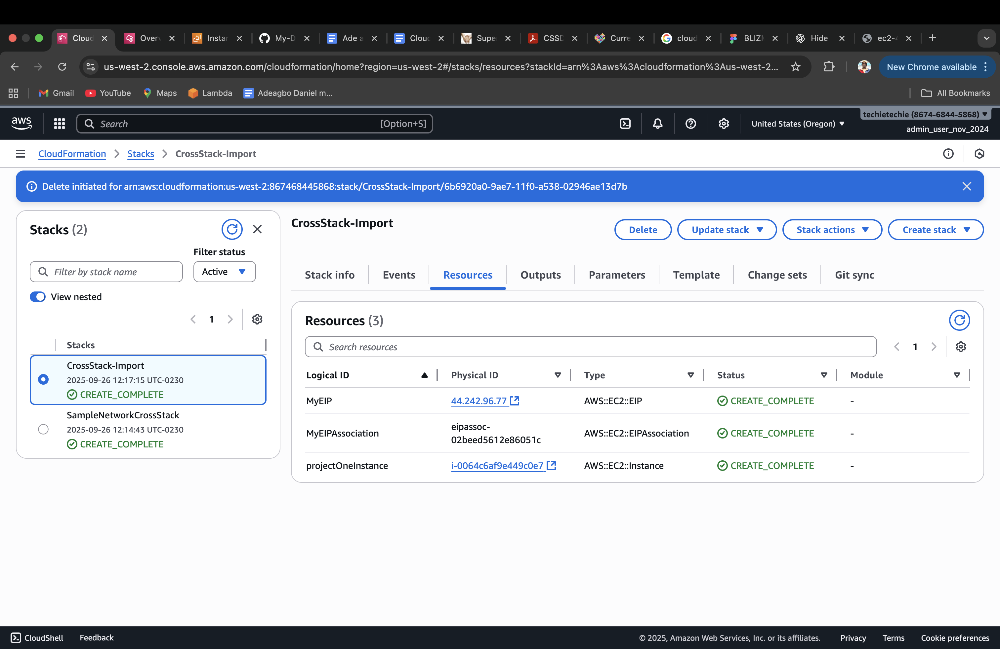
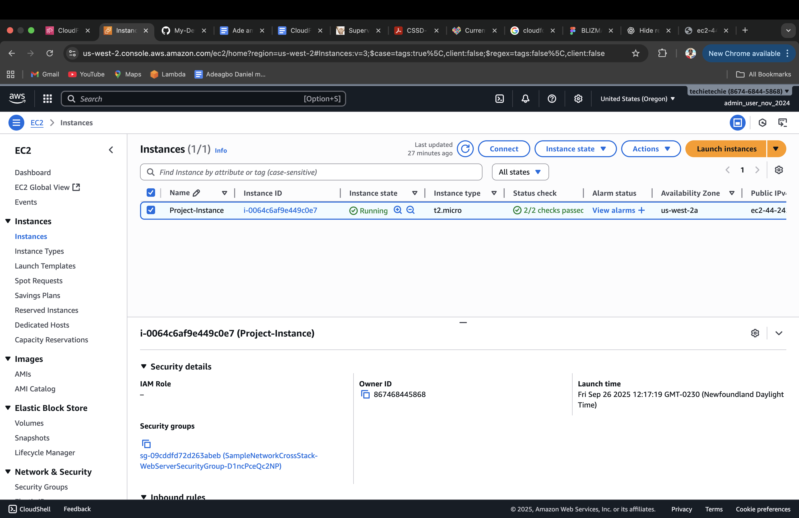
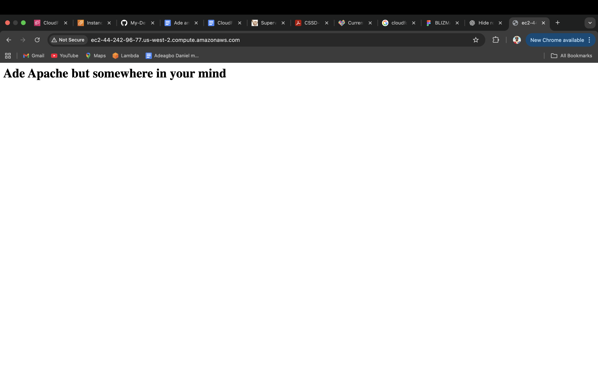

# CrossStackCloudFormation
This repository contains AWS CloudFormation templates for crossStackCloudFormation (This diagrams shows how templates link with each other.)

MINI PROJECT 

---

Deploy a sample network configuration stack. For the Stack name use: SampleNetworkCrossStack
### OUTPUT EXPORTING STACK

---

### VPC RESOURCE MAP
This diagram shows the base VPC with public subnets.

---

### Deployed Template (Importer)
Deployed template in us-west-2 region to allocate an Elastic IP Address using resources, Reference all available variables from SampleNetworkCrossStack, Create a Mapping function to dynamically choose regions, Create Parameters for requesting user inputs as much as possible, Output the value of the Private IPV4 Address and DNS name of the EC2 instance

---

### Running EC2
My EC2 Running with the Security Group from Previous Stack.

---

### My Website
Website_Preview

